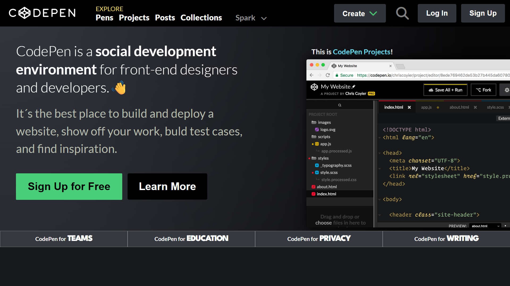

# 🎨 Coding Foundations Final Project


## 📋 Project Overview

This project is the **final assignment** for the **Coding Foundations Bootcamp**, where the objective was to create a pixel-perfect visual replica of the classic CodePen.io landing page. The challenge focused on translating a static design mockup into a fully functional, responsive web page using HTML and CSS.

---

## 🎯 Objective

The goal was to replicate the original CodePen landing page design as accurately as possible, paying close attention to:

- ✨ Layout structure and positioning
- 🎨 Color schemes and typography
- 📐 Spacing, margins, and padding
- 🖼️ Visual hierarchy and component styling
- 💫 Gradient backgrounds and visual effects

### 🖼️ Design Reference

**Original Design:**


**Final Result:**



---

## 🛠️ Technologies Used

| Technology                                                                                                             | Purpose                                     |
| ---------------------------------------------------------------------------------------------------------------------- | ------------------------------------------- |
|                      | Semantic structure and content organization |
|                         | Styling, layouts, and visual effects        |
|  | Icons and visual elements                   |
|       | Custom typography (Lato, League Spartan)    |

---

## 📁 Project Structure

```
coding-foundations-final-project/
│
├── index.html                          # Main HTML file
├── styles/
│   └── landing-page.css               # Main stylesheet
├── images/
│   ├── logo/
│   │   └── logo-codepen.png          # CodePen logo
│   ├── content/
│   │   └── image-landing-page.png    # Main content image
│   └── readme/
│       ├── objetive-final-proyect-coding-foundations.jpg
│       └── resutl-final-proyect-coding-foundations.jpg
└── README.md                          # Project documentation
```

---

## ✨ Key Features Implemented

### 🎯 Header Section

- **Responsive navigation bar** with logo and menu items
- **Interactive buttons** (Create, Search, Log In, Sign Up)
- **Dropdown indicators** for expandable menu items
- **Custom styling** with dark theme

### 🌟 Hero Section

- **Two-column layout** with content and image
- **Gradient background** with multiple radial gradients
- **Typography hierarchy** with custom font weights
- **Call-to-action buttons** (Sign Up for Free, Learn More)
- **Featured section** showcasing CodePen Projects

### 📊 Footer Bar

- **Grid layout** with four equal sections
- **Custom typography** using League Spartan font
- **Themed content** (TEAMS, EDUCATION, PRIVACY, WRITING)

---

## 🎨 CSS Highlights

### 🌈 Custom Gradients

```css
background: radial-gradient(circle at top left, #34373f 0%, transparent 80%),
  radial-gradient(circle at top right, #08080a 0%, transparent 80%),
  radial-gradient(circle at bottom left, #212329 0%, transparent 80%),
  radial-gradient(circle at bottom right, #020203 0%, transparent 80%), #0a0a0b;
```

### 📏 Flexbox Layout

- Flexible navigation system
- Responsive button arrangements
- Content alignment and distribution

### 🎭 Typography

- **Primary Font:** Lato (100, 300, 400, 700, 900 weights)
- **Accent Font:** League Spartan (variable weights)
- **Icon Library:** Font Awesome 6

---

## 🚀 How to Run

1. **Clone the repository:**

   ```bash
   git clone https://github.com/CristianPlazaDEV/Coding-Foundations-Final-Proyect.git
   ```

2. **Navigate to the project folder:**

   ```bash
   cd coding-foundations-final-project
   ```

3. **Open the project:**

   - Simply open `index.html` in your preferred web browser
   - Or use a local server (Live Server extension in VS Code recommended)

4. **View the result:**
   - The page should load with all styles and images properly rendered

---

## 📸 Screenshots Comparison

| Aspect       | Original Design          | My Implementation          |
| ------------ | ------------------------ | -------------------------- |
| Header       | ✅ Faithful reproduction | ✅ Pixel-perfect match     |
| Hero Section | ✅ Complex gradients     | ✅ Successfully replicated |
| Typography   | ✅ Custom fonts          | ✅ Identical styling       |
| Layout       | ✅ Two-column design     | ✅ Responsive structure    |
| Footer       | ✅ Grid system           | ✅ Clean implementation    |

---

## 🎓 Learning Outcomes

Through this project, I strengthened my skills in:

- 🔍 **Analyzing designs** and breaking them down into components
- 🎨 **CSS advanced techniques** (gradients, flexbox, grid)
- 📱 **Responsive design** principles
- 🎯 **Attention to detail** in visual replication
- 🧩 **Semantic HTML** structure
- 💻 **Code organization** and best practices

---

## 🌟 Challenges & Solutions

| Challenge                    | Solution                                                |
| ---------------------------- | ------------------------------------------------------- |
| Complex gradient backgrounds | Used multiple radial gradients with precise positioning |
| Font weight variations       | Imported multiple font weights from Google Fonts        |
| Layout precision             | Applied flexbox with careful spacing and alignment      |
| Button styling               | Created consistent, reusable button styles              |
| Image positioning            | Used flexible containers with proper sizing             |

---

## 🔮 Future Improvements

- [ ] Add responsive breakpoints for mobile devices
- [ ] Implement interactive JavaScript features
- [ ] Add smooth scroll animations
- [ ] Create hover effects for buttons and links
- [ ] Optimize images for better performance
- [ ] Add accessibility features (ARIA labels, keyboard navigation)

---

## 👨‍💻 Author

**Your Name**

- 📧 Email: cristianplazadev@gmail.com
- 💼 LinkedIn: [Your LinkedIn Profile](https://www.linkedin.com/in/cristian-plaza-2a3819364/)
- 🐙 GitHub: [Your GitHub Profile](https://github.com/CristianPlazaDEV)

---

## 📜 License

This project was created for educational purposes as part of the **Coding Foundations Bootcamp** final assignment.

---

## 🙏 Acknowledgments

- 💡 **CodePen.io** for the original design inspiration
- 👨‍🏫 **Bootcamp instructors** for guidance and support
- 🎓 **Coding Foundations Bootcamp** for the learning opportunity
- 🌐 **Font Awesome** for the icon library
- 🔤 **Google Fonts** for typography resources

---

## 📞 Contact & Feedback

If you have any questions, suggestions, or feedback about this project, feel free to reach out or open an issue in the repository!

⭐ **If you found this project helpful, please give it a star!** ⭐

---

<div align="center">

**Made with ❤️ and lots of ☕ by CristianPlazaDEV**

_Coding Foundations Bootcamp - 2025_

</div>
